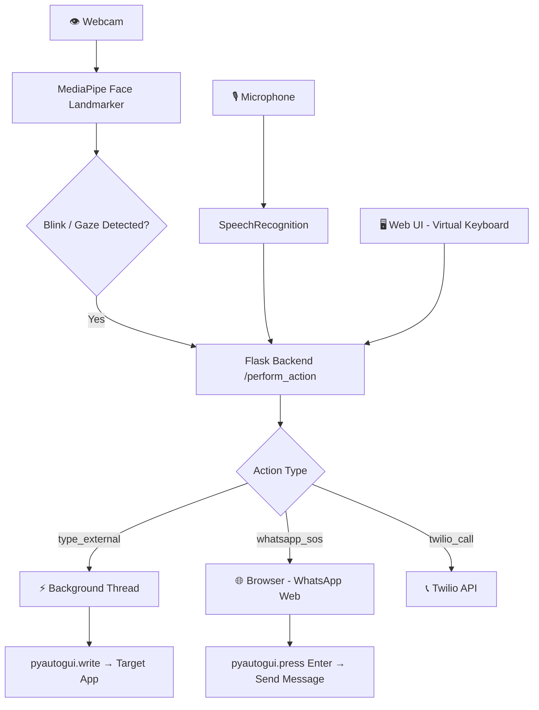

<div align="center">

# 👁️ Intentix

### *See. Blink. Speak. Control.*

**Assistive eye-, blink-, and voice-controlled toolkit for hands-free computer interaction, lightweight automation, and emergency workflows.**

<br/>

[](https://github.com/adityafilesx/Intentix)
[](https://www.python.org/)
[](https://flask.palletsprojects.com/)
[](https://mediapipe.dev/)
[](LICENSE)
[](https://github.com/adityafilesx/Intentix)

<br/>

[🚀 Quick Start](#-getting-started) · [✨ Features](#-key-features) · [🏗️ Architecture](#️-system-architecture) · [📖 Usage](#-usage-examples--workflows) · [🤝 Contributing](#-development--contributing)

</div>

---

## 🌟 Why Intentix?

> **Intentix** empowers users to interact with their computer using only their **eyes**, **blinks**, and **voice** — no hands required. Built for accessibility research, assistive technology prototypes, and emergency-response workflows.

| 🎯 Hands-Free Control | 🚨 Emergency Helpers | 🧠 Smart Automation |
|:---:|:---:|:---:|
| Eye gaze + blink detection | One-blink WhatsApp SOS | Type into any app |
| Voice command execution | Twilio emergency calls | Background threading |

---

## 📋 Table of Contents

- [✨ Key Features](#-key-features)
- [🖥️ Demo / Screenshots](#️-demo--screenshots)
- [🏗️ System Architecture](#️-system-architecture)
- [🗂️ Repository Structure](#️-repository-structure)
- [🛠️ Tech Stack](#️-tech-stack)
- [🚀 Getting Started](#-getting-started)
  - [Prerequisites](#prerequisites)
  - [Installation](#installation)
  - [Docker (optional)](#-docker-optional)
- [⚙️ Configuration & Environment Variables](#️-configuration--environment-variables)
- [📖 Usage Examples & Workflows](#-usage-examples--workflows)
- [🧪 Testing & CI](#-testing--ci)
- [💻 Supported Platforms](#-supported-platforms)
- [🔧 Troubleshooting](#-troubleshooting)
- [🔐 Security & Privacy](#-security--privacy)
- [🗺️ Roadmap](#️-roadmap)
- [🤝 Development & Contributing](#-development--contributing)
- [📜 License & Contact](#-license--contact)

---

## ✨ Key Features

| Feature | Description |
|---|---|
| 👁️ **Gaze & Blink Detection** | Real-time face landmark tracking via MediaPipe for hands-free control |
| ⌨️ **Virtual Keyboard** | On-screen keyboard + editable textarea ("Text Tag") as the main text input |
| 📤 **Type External** | Automatically types textarea content into any focused OS application |
| 🎙️ **Voice Commands** | Capture and execute voice commands (start/stop, confirm/cancel) |
| 🚨 **Emergency SOS** | Open WhatsApp Web with a pre-filled message or trigger a Twilio call |
| 🌐 **Flask Web UI** | Lightweight local web interface for control and configuration |
| ⚡ **Background Threading** | Non-blocking automation via worker threads |

---

## 🖥️ Demo / Screenshots

> 📸 *Screenshots and GIFs will be added here as the project matures.*

```
┌─────────────────────────────────────────────────┐
│              Intentix Web UI                    │
│  ┌─────────────────────────────────────────┐   │
│  │  > SELECT A MODE...                     │   │
│  │                                         │   │
│  └─────────────────────────────────────────┘   │
│                                                 │
│  [Q][W][E][R][T][Y][U][I][O][P]                │
│  [A][S][D][F][G][H][J][K][L]                   │
│  [Z][X][C][V][B][N][M]                         │
│                                                 │
│  [ TYPE EXTERNAL ]  [ 🎙️ VOICE ]  [ 🚨 SOS ]  │
└─────────────────────────────────────────────────┘
```

---

## 🏗️ System Architecture

<details>
<summary>📊 Click to expand Architecture Diagram (Mermaid)</summary>



</details>

### 🔄 Components & Data Flow

| Component | Role |
|---|---|
| **Web UI** (`templates/` + `static/`) | Renders virtual keyboard and `#output-area` textarea; triggers actions |
| **Flask App** (`main.py`) | Serves UI, handles `/perform_action` POST, parses and dispatches jobs |
| **Background Workers** | Execute `execute_type_external`, `auto_send_whatsapp`, `make_twilio_call` without blocking |
| **Camera + MediaPipe** | Detects gaze/blinks to trigger automated interactions |
| **pyautogui** | Sends keystrokes to the currently focused window (TYPE EXTERNAL, WhatsApp) |
| **Twilio** *(optional)* | Places emergency voice calls via TwiML |

---

## 🗂️ Repository Structure

```
Intentix/
├── main.py                  # Flask app, action handlers, automation helpers
├── eye_blink.py             # Eye/blink detection logic
├── fatigue_monitor.py       # Fatigue monitoring module
├── voice_commands.py        # Voice command capture and processing
├── tester.py                # Testing utilities
├── face_landmarker.task     # MediaPipe face landmarker model
├── requirements.txt         # Python dependencies
├── templates/
│   └── index.html           # Main web UI
├── static/
│   └── (CSS, JS assets)
└── README.md
```

> 💡 **Text Tag** — The central UI element is `<textarea id="output-area" placeholder="> SELECT A MODE..."></textarea>`. Client-side helpers (`add()`, `back()`, `clr()`, `moveCursor()`) manipulate it, and the TYPE EXTERNAL action sends its content to the server for `pyautogui.write()`.

---

## 🛠️ Tech Stack

<details>
<summary>🐍 Python Backend</summary>

| Library | Purpose |
|---|---|
| **Flask** | Web server and UI templates |
| **OpenCV** (`cv2`) | Camera capture and image utilities |
| **MediaPipe** | Face, gaze & blink detection via face_landmarker |
| **pyautogui** | UI automation — typing, key presses |
| **SpeechRecognition** | Voice command capture |
| **pynput** | Keyboard/mouse input monitoring |
| **NumPy** | Numerical operations |
| **Twilio** *(optional)* | Programmatic calls/SMS |
| **PyQt5** *(optional)* | Overlay cursor UI |

</details>

<details>
<summary>🌐 Frontend</summary>

| Technology | Purpose |
|---|---|
| **HTML / CSS** | UI layout and styling |
| **Vanilla JavaScript** | Dynamic keyboard, textarea interactions |

</details>

<details>
<summary>🔧 Optional / Infrastructure</summary>

| Tool | Purpose |
|---|---|
| **Docker** | Containerized development |
| **Redis** | Message queue (recommended for scale) |
| **S3 / Object Storage** | Artifact storage |

</details>

---

## 🚀 Getting Started

### Prerequisites

Before you begin, ensure you have:

- ✅ **Python 3.8+** and **pip**
- ✅ **Webcam** (for gaze/blink features)
- ⬜ Microphone *(optional — for voice features)*
- ⬜ PyQt5 *(optional — for overlay UI)*
- ⬜ Twilio account *(optional — for emergency call flows)*

### Installation

**1. Clone the repository**

```bash
# HTTPS
git clone https://github.com/adityafilesx/Intentix.git
cd Intentix

# or SSH
git clone git@github.com:adityafilesx/Intentix.git
cd Intentix
```

**2. Create a virtual environment and install dependencies**

```bash
python -m venv .venv

# macOS / Linux
source .venv/bin/activate

# Windows
.venv\Scripts\activate

pip install -r requirements.txt
```

**3. (Optional) Configure environment variables**

```bash
cp .env.example .env
# Edit .env with your Twilio credentials and settings
```

**4. Run the application**

```bash
python main.py
```

**5. Open in your browser**

```
http://127.0.0.1:5000/
```

> [!NOTE]
> If the MediaPipe face landmarker task file is missing, `main.py` will attempt to download it automatically on first run. If PyQt5 is not installed, overlay features are disabled with a warning.

### 🐳 Docker (optional)

You can containerize Intentix. Recommended steps for your Dockerfile:

```dockerfile
# Build from a Python base with required system packages
FROM python:3.10-slim
RUN apt-get update && apt-get install -y --no-install-recommends ffmpeg libsm6 libxext6 \
    && apt-get clean && rm -rf /var/lib/apt/lists/*

WORKDIR /app
COPY requirements.txt .
RUN pip install -r requirements.txt

COPY . .
EXPOSE 5000
CMD ["python", "main.py"]
```

> [!TIP]
> For webcam access inside Docker, use `--device /dev/video0` on Linux or host networking mode.

---

## ⚙️ Configuration & Environment Variables

| Variable | Description | Required |
|---|---|:---:|
| `TWILIO_SID` | Twilio Account SID | ⬜ Optional |
| `TWILIO_AUTH` | Twilio Auth Token | ⬜ Optional |
| `TWILIO_PHONE` | Twilio source phone number | ⬜ Optional |
| `emergency_contact` *(config)* | Emergency phone number for WhatsApp/Twilio — set via `SETTINGS["emergency_contact"]` in `config.json` or app config | ⬜ Optional |
| `BLINK_SENSITIVITY` | Blink detection threshold | ⬜ Optional |
| `OVERLAY_ENABLED` | Enable/disable cursor overlay | ⬜ Optional |

> [!WARNING]
> **Never commit secrets to source control.** Store credentials in a local `.env` file and ensure `.env` is listed in your `.gitignore`. Use GitHub Secrets or Vault for CI/CD environments.

---

## 📖 Usage Examples & Workflows

### ⌨️ TYPE EXTERNAL — End-to-End

1. **Focus** the target application window (Notepad, a web form, any text field).
2. In the **Intentix UI**, compose text in the `#output-area` textarea using the virtual keyboard or voice.
3. Click **"TYPE EXTERNAL"**.
4. A **countdown** begins — switch focus to your target window during this time.
5. After the countdown, `pyautogui.write(text, interval=0.1)` types the text into the focused window.

### 🚨 Emergency Flows

<details>
<summary>📱 WhatsApp SOS</summary>

1. Intentix opens `https://web.whatsapp.com/send?phone=<number>&text=<encoded_message>`.
2. If WhatsApp Web is already logged in, `pyautogui` presses **Enter** to send automatically (after a short wait).

</details>

<details>
<summary>📞 Twilio Emergency Call</summary>

1. Ensure `TWILIO_SID`, `TWILIO_AUTH`, and `TWILIO_PHONE` are set in your environment.
2. `make_twilio_call()` places a call using TwiML to speak the emergency message to the recipient.

</details>

---

## 🧪 Testing & CI

| Test Type | Approach |
|---|---|
| **Unit Tests** | Test core modules: gaze logic, command parsing, automation wrappers |
| **Integration Tests** | Use headless environment or mock `pyautogui` and `webbrowser` |
| **CI Pipeline** | `lint → unit tests → build artifact → (optional) publish` |

> [!TIP]
> For `pyautogui`-related tests, always mock `pyautogui.write` and other side-effecting calls to avoid unintended input events during test runs.

---

## 💻 Supported Platforms

| Platform | Status | Notes |
|---|:---:|---|
|  | ✅ Supported | Full feature support |
|  | ✅ Supported | May require accessibility permissions for pyautogui |
|  | ✅ Supported | Requires X11 display server — **Wayland is not supported** by pyautogui |

> [!NOTE]
> **macOS:** Grant *Accessibility* and *Camera* permissions to Terminal/Python in System Preferences → Security & Privacy.  
> **Linux:** Ensure the user has access to `/dev/video0` and a running X11 or Wayland session.  
> **Windows:** Run as a regular user; avoid UAC-elevated prompts as pyautogui cannot interact with elevated windows.

---

## 🔧 Troubleshooting

<details>
<summary>📷 Webcam not detected</summary>

- Verify the webcam is connected and not in use by another application.
- On Linux, check permissions: `ls -l /dev/video*` and add your user to the `video` group.
- Try changing the camera index in OpenCV: `cv2.VideoCapture(1)` instead of `0`.

</details>

<details>
<summary>🤖 MediaPipe model file missing</summary>

- On first run, `main.py` attempts to download `face_landmarker.task` automatically.
- If the download fails, manually download it from [MediaPipe Model Cards](https://developers.google.com/mediapipe/solutions/vision/face_landmarker) and place it in the project root.

</details>

<details>
<summary>⌨️ TYPE EXTERNAL not working</summary>

- Ensure the target window is focused **before** the countdown ends.
- On macOS, grant **Accessibility** permissions to Terminal/Python.
- On Linux, confirm you are running under X11 (pyautogui does not support Wayland directly).

</details>

<details>
<summary>🎙️ Voice commands not responding</summary>

- Verify microphone access is granted in OS settings.
- Check that `SpeechRecognition` and its dependencies (e.g., `pyaudio`) are installed.
- Test with: `python -c "import speech_recognition as sr; print(sr.Microphone.list_microphone_names())"`.

</details>

<details>
<summary>📦 PyQt5 import error</summary>

- PyQt5 is optional. If it's not installed, overlay features are disabled automatically.
- Install with: `pip install PyQt5`

</details>

---

## 🔐 Security & Privacy

> [!IMPORTANT]
> Intentix processes **live webcam video** and **microphone audio** entirely **locally**. No video or audio is transmitted to external servers.

| Consideration | Details |
|---|---|
| 🎥 **Camera data** | Processed locally by MediaPipe; never sent externally |
| 🎙️ **Microphone data** | Processed locally; check SpeechRecognition backend settings |
| 🔑 **Credentials** | Store Twilio and other secrets in `.env` — never commit to git |
| 🌐 **Network access** | Only outbound: WhatsApp Web URLs and Twilio API calls |
| 🛡️ **pyautogui scope** | Intentix controls the currently focused window; be cautious in multi-user environments |

---

## 🗺️ Roadmap

> What's coming next for Intentix:

- [ ] 🖥️ **Multi-monitor support** — gaze tracking across multiple screens
- [ ] 🌍 **Multilingual voice commands** — expand beyond English
- [ ] 🧩 **Plugin system** — custom action modules without core changes
- [ ] 📊 **Usage analytics dashboard** — local stats for accessibility research
- [ ] 🤖 **AI intent parsing** — NLP-powered command understanding
- [ ] 🔌 **REST API** — expose Intentix features to external tools
- [ ] 🧪 **Full test suite** — unit and integration coverage for all modules
- [ ] 📦 **PyPI package** — install via `pip install intentix`

---

## 🤝 Development & Contributing

Contributions are welcome! Here's how to get started:

**1. Fork and clone**

```bash
git clone https://github.com/<your-username>/Intentix.git
cd Intentix
```

**2. Create a feature branch**

```bash
git checkout -b feature/your-feature-name
```

**3. Make your changes, then test**

```bash
python -m pytest  # once tests are available
```

**4. Commit and push**

```bash
git commit -m "feat: describe your change"
git push origin feature/your-feature-name
```

**5. Open a Pull Request** against `main`.

### Contribution Guidelines

- Follow [PEP 8](https://peps.python.org/pep-0008/) for Python code style.
- Keep PR scope focused — one feature or fix per PR.
- Add or update docstrings for any modified functions.
- Mock side-effecting calls (`pyautogui`, `webbrowser`, `twilio`) in tests.
- Update this README if your change adds new features or changes setup steps.

---

## 📜 License & Contact

**License:** MIT — see [LICENSE](LICENSE) for details.

**Repository:** [https://github.com/adityafilesx/Intentix](https://github.com/adityafilesx/Intentix)

**Issues & Questions:** Open a [GitHub Issue](https://github.com/adityafilesx/Intentix/issues) for bug reports, feature requests, or questions.

---

<div align="center">

Made with ❤️ for accessibility and assistive technology.

⭐ If Intentix helps you, please consider giving it a star!

</div>

